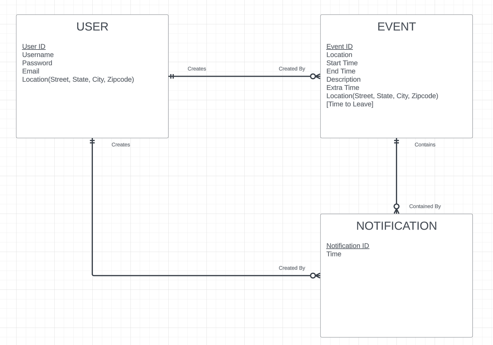
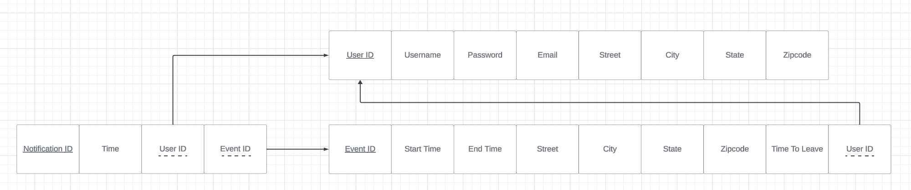
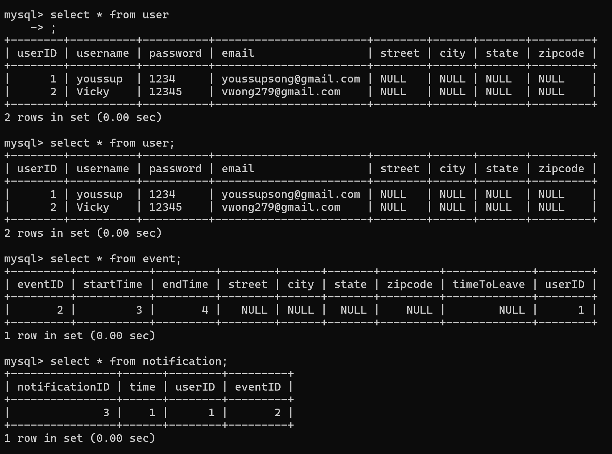

# WebDatabaseProgramming
### The calendar will have all normal functions, plan events, tasks, etc. Added functions: App will track your location or you may set a default location You can add a location to every event you plan This will allow the application to do some calculation to decide when to leave based on user inputs + google map's api The user may input how much extra time/variation they would want and also input when and how many times they'd like to be notified The app will notify you if there are any conditions that may appear while you are going to this event using some weather's api The app will notify you if there is any sudden traffic and may ask you to leave earlier than planned

